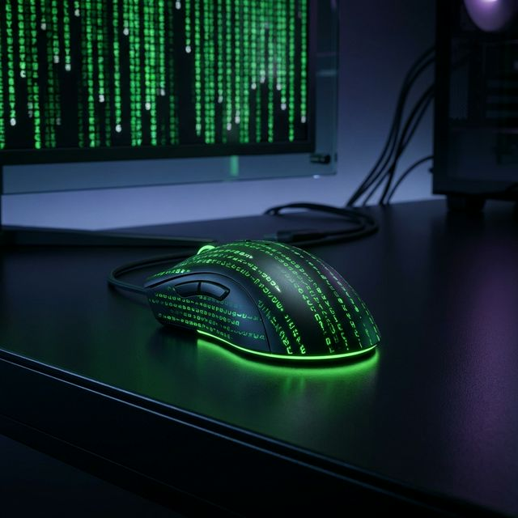

# WiggleMe AI

<div align="center">
  
</div>

### AI-Powered Human-Kinematic Mouse Simulator

WiggleMe AI is a next-generation mouse movement tool that uses **AI behavioral fingerprinting** to generate movements indistinguishable from real human interaction. Unlike traditional mouse jigglers that use repetitive, easily-detected patterns, WiggleMe AI learns YOUR unique movement signature and generates authentic variations every single time.

## Key Features

### AI Movement Engine

- **Behavioral Fingerprinting**: Records your natural mouse movements and builds a unique behavioral model
- **WindMouse Physics**: Organic, physics-based cursor movement with gravity, wind forces, and inertia
- **Bezier Curve Generation**: Smooth, natural arcs instead of straight-line bot movement
- **Micro-Jitter Simulation**: Sub-pixel natural hand tremor for authenticity
- **Overshoot & Correction**: Simulates the natural human tendency to overshoot targets
- **Speed Variance**: Natural acceleration/deceleration curves (never constant speed)

### Workplace Intelligence

- **Temporal Awareness**: Automatically follows work schedule patterns (9-5, lunch breaks, afternoon slump)
- **Meeting Detection**: Pauses during Teams/Zoom/Slack calls
- **Manual Override Detection**: Instantly stops when you use the mouse yourself
- **Smart Pauses**: Generates realistic pause patterns (thinking, reading, context-switching)

### Authenticity Scoring

- **Real-time Score (0-100)**: Quantifies how human-like each movement is
- **Speed Variance Analysis**: Checks for natural acceleration patterns
- **Curve Smoothness Analysis**: Validates organic curve quality
- **Micro-Jitter Validation**: Confirms natural hand tremor presence
- **Detection Risk Assessment**: LOW / MEDIUM / HIGH risk indicator

### Modern UI

- Dark theme with real-time authenticity gauge
- Movement statistics dashboard
- One-click start/stop
- System tray support (minimize to tray)

## How It Works

### 1. Learn Your Movement (Optional but Recommended)

Click "LEARN MY MOVEMENT" and work normally for 2-5 minutes. The AI records:

- Your typical cursor speed and variance
- Your pause patterns and frequency
- Your preferred screen areas
- Your movement curve preferences
- Your direction bias and handedness

### 2. Generate Authentic Movement

Click "START" and the AI generates movements that:

- Match your personal movement fingerprint
- Are unique every time (never repeats)
- Follow natural acceleration/deceleration
- Include realistic pauses and hesitations
- Respect your work schedule

### 3. Monitor Authenticity

The real-time dashboard shows:

- Current authenticity score (target: 80+)
- Detection risk level
- Movement count and session stats
- Active temporal awareness status

## Build

### Requirements

- Windows 10/11
- Visual Studio 2022 Build Tools (C++ workload)

### Build Steps

```bash
# Clone the repository
git clone https://github.com/randykwheeler/WiggleMe-AI.git
cd WiggleMe-AI

# Build
build.bat

# Run
WiggleMeAI.exe
```

## Technical Architecture

```
WiggleMe-AI/
├── include/
│   └── ai_movement.h      # AI engine header (Point2D, UserFingerprint, etc.)
├── src/
│   ├── ai_movement.cpp     # AI movement generation implementation
│   └── main.cpp            # Win32 UI + worker threads
├── build.bat               # MSVC build script
└── README.md
```

### Core Components

- **AIMovementEngine**: Generates trajectories using WindMouse physics + Bezier curves
- **UserFingerprint**: Behavioral model learned from recorded user movements
- **PerlinNoise1D**: Organic noise for natural jitter and speed variation
- **TemporalProfile**: Work schedule awareness with hourly intensity curves
- **Meeting Detection**: Process scanning for video conferencing apps

## License

MIT License

## Disclaimer

This tool is designed for legitimate workplace use cases including accessibility accommodations, break automation, and activity simulation. Users are responsible for compliance with their organization's policies.
